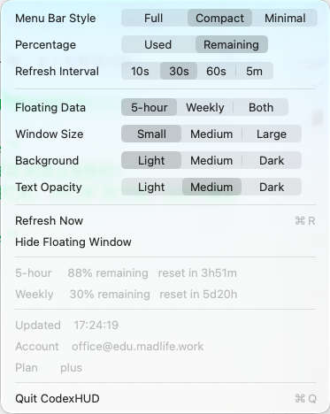
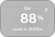

# CodexHUD

CodexHUD 是一个轻量的 macOS 菜单栏工具，用来把 Codex 的 5 小时窗口和 Weekly 用量直接常驻显示在菜单栏上。

它的核心目标很简单：

> 不用点开 Codex，不用进入 CLI，也不用打开复杂面板，就能一眼看到 Codex 额度状态。

## Preview



可选悬浮 HUD：



## Features

- 菜单栏直接显示 Codex 用量，例如 `Cdx 42/18` 或 `Cdx ⚠ 100/51`
- 支持 5-hour rolling window
- 支持 Weekly usage window
- 支持已用百分比 / 剩余百分比切换
- 支持 Full / Compact / Minimal 菜单栏显示模式
- 支持 10s / 30s / 60s / 5m 刷新频率
- 支持可选悬浮 HUD：5-hour / Weekly / Both
- 支持悬浮 HUD 尺寸、背景透明度、文字透明度设置
- 支持隐藏 / 显示悬浮窗口
- 点击菜单栏可查看重置倒计时、更新时间、账号、Plan、数据源
- 支持手动刷新
- 支持错误状态：`Cdx ?`
- 支持数据过期状态：`Cdx stale`

## Data Source

CodexHUD 不使用 mock 数据。

当前版本通过本机 Codex CLI 的 app-server JSON-RPC 读取真实用量：

```sh
codex -s read-only -a untrusted app-server
```

调用的 RPC 方法：

```text
account/rateLimits/read
account/read
```

字段映射：

| Codex RPC 字段 | CodexHUD 含义 |
| --- | --- |
| `rateLimits.primary` | 5-hour window |
| `rateLimits.secondary` | Weekly window |
| `usedPercent` | 已用百分比 |
| `windowDurationMins` | 窗口长度 |
| `resetsAt` | 重置时间 |

## Privacy

CodexHUD 以本地使用为主：

- 不上传 Codex 用量数据
- 不上传 prompt
- 不上传代码内容
- 不读取 Codex session 日志
- 不读取浏览器 cookies
- 不直接读取 `auth.json`
- 仅通过本机已安装的 Codex CLI app-server 获取用量

## Build

```sh
cd CodexHUD
make test
make build
```

构建完成后，App 位于：

```text
CodexHUD/.build/CodexHUD.app
```

## Run

```sh
cd CodexHUD
make run
```

或者直接打开：

```sh
open -n CodexHUD/.build/CodexHUD.app
```

## Verify The Codex RPC

```sh
cd CodexHUD
make probe
```

如果可用，会输出类似：

```json
{
  "planType": "plus",
  "primary": {
    "usedPercent": 42,
    "windowDurationMins": 300
  },
  "secondary": {
    "usedPercent": 18,
    "windowDurationMins": 10080
  }
}
```

## Current Scope

第一版专注菜单栏直显、真实 RPC 取数和轻量悬浮 HUD。自动更新、Homebrew 安装、多账号管理和历史趋势图会留到后续版本。
